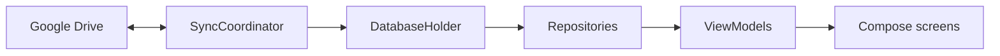

# FinanceApp

**Personal finance for Android — built on the [MoneyManagerEx](https://moneymanagerex.org/) `.mmb` format.**

Open the same file on your phone and on desktop MMEX. No custom backend. Sync through Google Drive, or keep everything local.

[](https://kotlinlang.org/)
[](https://developer.android.com/compose)
[](https://developer.android.com/)
[](LICENSE)

---

## Why this app

Most mobile finance apps lock you into their own database. FinanceApp reads and writes **real MoneyManagerEx SQLite files** (`.mmb`) without rewriting the schema, so a file created in [MMEX desktop](https://github.com/moneymanagerex/moneymanagerex) opens here — and a transaction added here still opens cleanly back in MMEX.

| You get | How it works |
|---|---|
| One source of truth | All money data lives in the `.mmb` file |
| No server | Nothing is uploaded except the file you choose on Drive |
| Round-trip safety | Existing tables, indexes, and `INFOTABLE_V1` are left intact |
| Desktop + phone | Same file format as official MMEX clients |

---

## Features

**Accounts & money**
- Cash and investment accounts, grouped by type, with balances per currency
- Income, expense, and transfer — including different source/destination amounts
- Nested categories with a full-path picker
- Currencies from the MMEX table, assigned per account
- Hide individual accounts or mask balances on the home screen

**Day to day**
- Transaction list per account, plus a global filter (notes, amount, category, account, date range)
- Inline calculator when entering amounts
- Scheduled / recurring transactions (`BILLSDEPOSITS_V1`) — approve or skip when due
- Monthly spending budget per currency, with progress vs. expected pace
- Default category per transaction type (or reuse the last one used)

**Files & sync**
- Create a new `.mmb`, open a local file, or pick one from Google Drive
- Read-write or read-only access
- Upload after every write and when the app goes to the background
- Conflict dialog if the remote file changed: keep local or use remote

---

## Screens

| Screen | What it does |
|---|---|
| First launch | Create a file, open a local `.mmb`, or connect Drive |
| Accounts | Balances, totals by currency, budget chip, sync |
| Account | Ledger for one account; add / edit / delete |
| Transaction | Type, accounts, date, category tree, amount, notes |
| Filter | Search across the file (or one account) |
| Scheduled | Recurring rules; due prompt on cold start and foreground |
| Settings | Drive, access mode, accounts / categories / currencies / schedules, budget |

---

## Architecture

Two Gradle modules. Domain and database live in `:shared` so a desktop Compose target can join later without rewriting the ledger.

```
shared/       Kotlin Multiplatform — models, SQLDelight, Drive, sync
androidApp/   Jetpack Compose UI, ViewModels, Koin app module
```



Writes never invent extra tables. SQLDelight generates queries against the MMEX schema; opening an existing file uses the raw SQLite driver so `Schema.create()` is **not** run on a live `.mmb`.

---

## Tech stack

| Layer | Choice |
|---|---|
| Language | Kotlin 2.3 |
| UI | Jetpack Compose + Material 3 |
| Shared logic | Kotlin Multiplatform (Android target today) |
| Database | [SQLDelight](https://cashapp.github.io/sqldelight/) 2.0 on MMEX SQLite |
| DI | [Koin](https://insert-koin.io/) 3.5 |
| Settings | DataStore Preferences |
| Sync | Google Drive Android SDK + Play Services Auth |
| Navigation | Navigation Compose |
| Async | Coroutines + Flow |

**Requires Android 8.0 (API 26)+.** Compile / target SDK 35. JDK 17.

---

## Getting started

### Prerequisites

- [Android Studio](https://developer.android.com/studio) (Meerkat / recent) with the Android SDK
- JDK 17 (Android Studio JBR is fine)
- A device or emulator

### Open and run

1. Clone the repo and open the project root in Android Studio.
2. Let Gradle sync (`Gradle 8.13` via the wrapper).
3. Run the `:androidApp` configuration.

From the command line:

```bash
./gradlew :androidApp:assembleDebug
./gradlew :androidApp:installDebug
```

On Windows, `build.ps1` sets `JAVA_HOME` to the Android Studio JBR and writes the full Gradle log to `.tmp/gradle/log.txt`.

### Google Drive (optional)

Drive sync needs a Google Cloud OAuth client and `androidApp/google-services.json` (package `com.konhit.financeapp`). Register the SHA-1 of your debug (and release) keystore on that client. The app also works fully offline with a local `.mmb`.

---

## Tests

Compatibility cases live under `shared/src/androidTest` and follow the `TC-xx` numbering in [`finance-app-spec.md`](finance-app-spec.md). They open a fixture `.mmb` and assert account load, balances, insert defaults, and schema preservation (no extra tables, `DATAVERSION` stays `3`).

```bash
./gradlew :shared:testDebugUnitTest
./gradlew :shared:connectedAndroidTest
```

Single class:

```bash
./gradlew :shared:connectedAndroidTest \
  -Pandroid.testInstrumentationRunnerArguments.class=com.konhit.financeapp.db.TC01_OpenExistingTest
```

Place `example.mmb` in `shared/src/androidTest/assets/` for instrumented tests (the file is gitignored).

---

## Compatibility notes

FinanceApp is a **client** of the MMEX file format, not a fork of MMEX. Constraints that keep files interchangeable:

- Never `CREATE` / `ALTER` / `DROP` against an existing `.mmb`
- Transaction codes are the full words `Deposit`, `Withdrawal`, `Transfer`
- `INFOTABLE_V1` is read-only after file creation
- Balances are derived, never stored:

```
INITIALBAL
  + deposits in the account
  − withdrawals from the account
  + incoming transfer amounts (TOTRANSAMOUNT)
  − outgoing transfer amounts (TRANSAMOUNT)
```

Feature specs and plans live in [`docs/specs/`](docs/specs/).

---

## License

[MIT](LICENSE) © 2026 KonH

[MoneyManagerEx](https://github.com/moneymanagerex/moneymanagerex) is a separate project with its own license. This app is not affiliated with the MMEX team.
